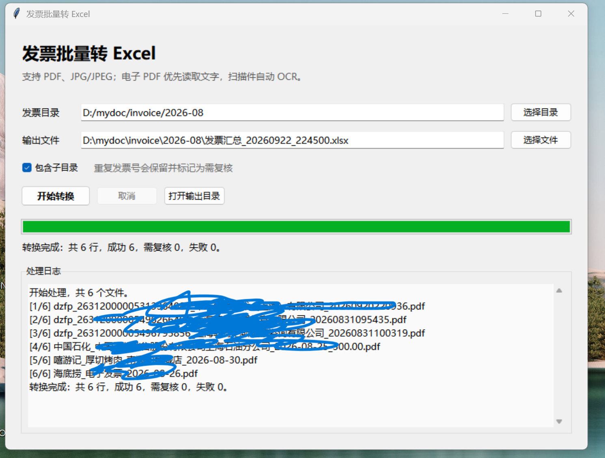
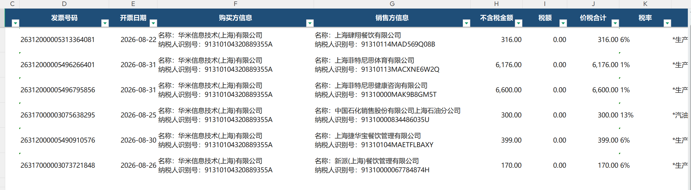

# 发票批量转 Excel

这是一个 Windows 桌面客户端。选择目录后，程序会批量读取 PDF、JPG/JPEG 发票，并把每张发票的关键字段写入 Excel 的一行。

## 界面预览



## 输出示例



## 使用方法

1. 安装 Python 3.10 至 3.13，并勾选“Add Python to PATH”。
2. 双击 `安装依赖.bat`，首次安装可能需要几分钟。
3. 双击 `启动发票转换工具.bat`。
4. 选择发票目录与 Excel 输出位置，点击“开始转换”。

程序支持子目录。电子 PDF 会优先直接提取文字；扫描 PDF 和 JPG 会自动使用本地 OCR。识别过程不需要把发票上传到云端。

## Excel 字段

发票类型、发票代码、发票号码、开票日期、购买方信息（名称和纳税人识别号）、销售方信息（名称和纳税人识别号）、不含税金额、税额、价税合计、税率、项目名称、备注、收款人、复核人、开票人、来源文件、页码、识别方式、OCR 置信度、识别状态、异常说明。

“购买方信息”和“销售方信息”各占一个 Excel 单元格，名称与纳税人识别号在单元格内分两行显示。

识别结果为“需复核”或“失败”时，请结合来源文件人工检查。重复发票号会保留，并在“异常说明”中标记。

## 命令行开发与测试

```powershell
py -m venv .venv
.venv\Scripts\python -m pip install -r requirements.txt
.venv\Scripts\python -m unittest discover -s tests -v
.venv\Scripts\python main.py
```

## 打包为 EXE（可选）

```powershell
.venv\Scripts\python -m pip install pyinstaller
.venv\Scripts\pyinstaller --noconfirm --clean --windowed --name 发票批量转Excel --collect-all rapidocr main.py
```

生成的程序位于 `dist\发票批量转Excel\`。RapidOCR 模型需要随程序一起分发，因此建议使用文件夹版，而不是单文件版。
